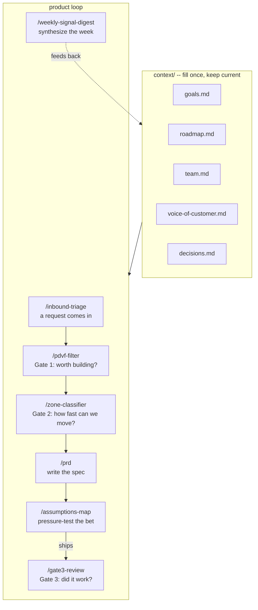

# Seam Starter Kit

An AI operating system for product teams. Built on Claude Code.

[](https://creativecommons.org/licenses/by/4.0/)

## What you need

- [Claude Code](https://claude.ai/code) installed (`npm install -g @anthropic-ai/claude-code`)
- A Claude account (Pro or above recommended)
- 15 minutes to fill in your context files

## Setup

**1. Clone this repo**

```bash
git clone https://github.com/davemastersnyc/seam-starter.git
cd seam-starter
```

**2. Fill in your context files**

Open the `context/` folder. Each file has instructions inside. Fill in:

- `context/goals.md` -- what the team is trying to move this quarter
- `context/roadmap.md` -- what's in flight and planned
- `context/team.md` -- who's on the team and how decisions get made
- `context/voice-of-customer.md` -- customer signal, themes, direct quotes
- `context/decisions.md` -- standing decisions and the reasoning behind them

Be honest and specific. Skills are only as useful as the context they draw from.

**3. Open Claude Code**

```bash
claude
```

**4. Run a skill**

Type `/inbound-triage` and describe a request that came in this week.

## How it works

Every skill reads from your `context/` files before generating output. You fill the context once and keep it current. The skills handle the rest.



The weekly digest is the feedback loop. Signal from customers and shipped work flows back into your context files, keeping the whole system current.

## Skills

| Command | What it does |
|---|---|
| `/inbound-triage` | Score an inbound request against your goals |
| `/pdvf-filter` | Gate 1 -- score an idea on Problem, Desirability, Viability, Feasibility |
| `/zone-classifier` | Gate 2 -- classify work by risk and dependency level |
| `/gate3-review` | Gate 3 -- did shipped work actually change behavior? |
| `/prd` | Full PRD grounded in your goals and customer signal |
| `/assumptions-map` | Map and pressure-test the riskiest assumptions behind a bet |
| `/weekly-signal-digest` | Synthesize the week's signal every Monday |

## Keeping context current

The skills compound over time as your context files stay current. A 10-minute weekly pass through the files -- updating what's in flight, adding new customer quotes, logging decisions -- is what makes the system sharp.

## Upgrade: live context API

The starter kit reads from local files. When you're ready for context that updates automatically -- without anyone editing markdown by hand -- deploy the included API service.

```
seam-starter/
  api/          ← deploy this to Vercel
  context/      ← files the API serves
```

The API reads your context files from a public URL (default: GitHub raw content) and returns them as JSON. Any tool that commits to your repo updates the context automatically. Skills detect the API and switch to it when `SEAM_API_URL` is set in `.env.local` -- file-based mode stays fully functional without it.

See [`api/README.md`](api/README.md) for setup instructions.

## Want the full version?

The starter kit is self-serve. The full Seam installation includes a configured live context API, tool integrations (Linear, Slack, Intercom), and a setup tailored to your team's workflow.

Book a scoping call: https://tidycal.com/davemastersnyc

---

Built by [Dave Masters](https://quietbranches.com) / [Quiet Branches Labs](https://quietbranches.com)
Licensed under [CC BY 4.0](https://creativecommons.org/licenses/by/4.0/) -- share and adapt freely with attribution.
