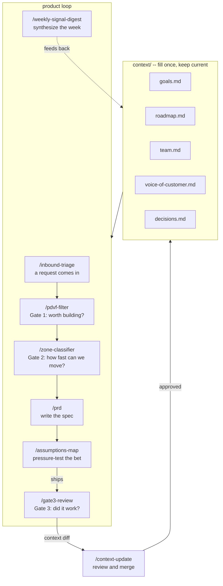

# Seam Starter Kit

The bottleneck in product work used to be writing code.
It isn't anymore.

At AI-assisted velocity, a team can ship five features in the time
it used to take to ship one. The constraint has moved: to deciding
what to build, keeping everyone working from the same reasoning,
and knowing whether what shipped actually changed anything.

Most teams think they're aligned. They're sharing the shape of an
idea: the ticket, the doc, the brief. Not the shading behind it:
the reasoning, the customer context, the tradeoffs that were
considered and rejected. At AI velocity, that gap compounds in
days, not quarters.

Seam maintains the shading. A shared context layer every AI tool
on your team reads before it starts: your goals, your customer
signal, your standing decisions, and the reasoning behind them.

This is the starter kit. Fifteen minutes to set up. Built on Claude Code.

[](https://creativecommons.org/licenses/by/4.0/)

## What you need

- [Claude Code](https://claude.ai/code) installed. The linked page walks through the install, including the one-line command if you're comfortable in the terminal (`npm install -g @anthropic-ai/claude-code`).
- A Claude account (Pro or above recommended).
- About 15 minutes to fill in your context files.

## Setup

**1. Get the starter kit onto your computer.**

The simplest way: go to the [GitHub page](https://github.com/davemastersnyc/seam-starter), click the green **Code** button, choose **Download ZIP**, and unzip it wherever you keep projects.

If you use git, you can clone instead:

```bash
git clone https://github.com/davemastersnyc/seam-starter.git
cd seam-starter
```

**2. Fill in your context files.**

Open the `context/` folder. Each file has instructions inside. Fill in:

- `context/goals.md` -- what the team is trying to move this quarter
- `context/roadmap.md` -- what's in flight and planned
- `context/team.md` -- who's on the team and how decisions get made
- `context/voice-of-customer.md` -- customer signal, themes, direct quotes
- `context/decisions.md` -- standing decisions and the reasoning behind them

Be honest and specific. Skills are only as useful as the context they draw from.

**3. Open Claude Code in the seam-starter folder.**

In your terminal, navigate to the folder and type:

```bash
claude
```

If you're not sure what a terminal is or how to navigate to the folder, the Claude Code install page from Step 1 covers it.

**4. Run a skill.**

In the Claude Code chat, type `/inbound-triage` and describe a request that came in this week.

## Already have a Claude Code project? Add seam alongside it.

If you already have a project running with its own CLAUDE.md and skills, you don't need to clone this as a separate workspace. You can drop seam into your existing project, and your CLAUDE.md stays exactly as it is.

Three things to do. No terminal commands required for any of it.

**1. Copy two folders from seam-starter into your project.**

- Copy everything inside the `.claude/skills/` folder into your project's `.claude/skills/` folder. If your project doesn't have that folder yet, create it.
- Copy the whole `context/` folder into the root of your project. That's the same folder your CLAUDE.md lives in.

Drag them in Finder or File Explorer. That's it for this step.

**2. Add five lines to the bottom of your existing CLAUDE.md.**

Open your CLAUDE.md in any text editor and paste these at the end:

```
@context/goals.md
@context/roadmap.md
@context/voice-of-customer.md
@context/decisions.md
@context/team.md
```

The `@` symbol tells Claude Code to load each of those files automatically every time you start a session. Your own CLAUDE.md stays untouched. Seam's context loads alongside it.

**3. Fill in the five context files.**

Open the `context/` folder in your project. Each file has instructions at the top. Plain sentences are fine. No formatting required.

To check that it worked, open Claude Code in your project and type `/inbound-triage`. Describe a recent request your team got. If the output references your real goals and roadmap, the setup is live.

---

**Want seam's files in their own subfolder instead of mixed with your project files?** Put them anywhere you like (e.g. in a folder called `seam/`) and update the paths in your CLAUDE.md to match, like `@seam/context/goals.md`. Claude Code will find them from wherever you point.

## How to edit your context files

Open the `context/` folder in any text editor. If you're not sure which one to use:

- Cursor (recommended if you're using Claude Code anyway)
- VS Code
- Any plain text editor. TextEdit on Mac, Notepad on Windows.
- Or just open them directly in GitHub and edit in the browser if you cloned from there.

The files are plain markdown. You don't need to know markdown to fill them in. Write in plain sentences. The skills don't care about formatting.

## How it works

Every skill reads from your `context/` files before generating output. You fill the context once and keep it current. The skills handle the rest.



The write-back loop is how your context stays current without anyone maintaining it by hand. `/gate3-review` generates a short list of proposed updates to your context files after each feature ships. `/context-update` lets you review and approve them. The weekly digest adds lighter updates between gate 3 reviews.

## Skills

| Command | What it does |
|---|---|
| `/inbound-triage` | Score an inbound request against your goals |
| `/pdvf-filter` | Gate 1 -- score an idea on Problem, Desirability, Viability, Feasibility |
| `/zone-classifier` | Gate 2 -- classify work by risk and dependency level |
| `/gate3-review` | Gate 3 -- did shipped work actually change behavior? Emits a context diff. |
| `/context-update` | Review and merge a context diff from /gate3-review or /weekly-signal-digest. One human reviews before anything is written. |
| `/prd` | Full PRD grounded in your goals and customer signal |
| `/assumptions-map` | Map and pressure-test the riskiest assumptions behind a bet |
| `/weekly-signal-digest` | Synthesize the week's signal every Monday |

## Keeping context current

The write-back loop handles this for you. You don't have to remember to update the context files by hand.

Here's how it runs in practice:

1. After a feature ships and the review window closes, run `/gate3-review`.
2. It produces two things: a verdict on whether the feature actually changed behavior, and a short list of proposed updates to your context files (a "context diff" -- just a plain-language list of what should be added, changed, or removed).
3. Paste that list into `/context-update`. It walks through each proposed change.
4. You reply with `approve`, `edit`, or `reject`. If you approve, Claude Code writes the changes to your context files and logs them in `decisions.md`.

The weekly signal digest is the lighter version of this, useful for customer signal that doesn't come from a gate 3 review. Run it Monday morning and skim the output for anything that should update your context files.

A gate 3 review that produces no proposed updates is a flag, not a pass. Something was learned, or nothing was -- either way, write one sentence in the related ticket or doc explaining why.

## Upgrade: live context API

**This section is for when you want to scale seam across multiple repos or a bigger team.** It involves a bit of infrastructure setup and is usually a job for an engineer on your team. The starter kit works fully without it -- this is an upgrade, not a requirement.

**What it does in plain terms:** instead of every project reading context from its own local files, a small service hosts your context files at a single URL. Every project points at that URL. When you update one file in one place, every skill in every project sees the update the next time it runs.

**When you'd want it:**
- You have more than one repo (web, mobile, internal tools) and you want a single source of truth.
- Your context is shifting often enough that editing it in five places is painful.
- You're ready to hand off the setup to an engineer.

**What's involved:**

```
seam-starter/
  api/          ← deploy this to Vercel
  context/      ← files the API serves
```

The API reads your context files from a public URL (default: GitHub raw content) and returns them as JSON. Any tool that commits to your repo updates the context automatically. Skills detect the API and switch to it when `SEAM_API_URL` is set in `.env.local` -- file-based mode stays fully functional without it.

The live API requires a cron secret to trigger automatic updates. Without it, the API works locally but context will not update automatically in production. To set this up, add `CRON_SECRET` to your Vercel environment variables. Until that's configured, file-based mode works fully and nothing breaks -- updates just require a manual deploy.

Working across multiple repos? Keep one context repo and point all your other repos at it via `SEAM_API_URL`. Update context once, every skill everywhere reads it automatically.

See [`api/README.md`](api/README.md) for step-by-step setup instructions your engineer can follow.

## What's in this kit vs. the full Seam

The starter kit is the self-serve core: the context layer, the skills that read it, and the write-back loop that keeps it current. Everything here runs locally on Claude Code. No services, no integrations, no API keys required.

**What's in the starter**

- 8 skills: `/inbound-triage`, `/pdvf-filter`, `/zone-classifier`, `/gate3-review`, `/context-update`, `/prd`, `/assumptions-map`, `/weekly-signal-digest`
- 5 context files: goals, roadmap, team, voice-of-customer, decisions
- The full write-back loop via `/gate3-review` into `/context-update`
- An optional live context API (see the upgrade section above) for multi-repo setups

**What the full Seam engagement adds (4-6 weeks)**

- Tool integrations: Linear, Slack, Intercom, your analytics stack
- Automatic inbound triage from support channels
- A live context API configured and running for your team
- Additional skills: design review briefs, account briefs, cycle kickoff, intercom synthesis, divergence detection, and context export
- A setup tuned to how your team actually works

If you're running the starter and bumping into the edges, that's usually when the full engagement starts earning its keep. You want triage to run automatically from Intercom. Context needs to update across five repos at once. Linear tickets need to read from the same source as the PRD skill.

Book a scoping call: https://tidycal.com/davemastersnyc

---

Built by [Dave Masters](https://quietbranches.com) / [Quiet Branches Labs](https://quietbranches.com)
Licensed under [CC BY 4.0](https://creativecommons.org/licenses/by/4.0/) -- share and adapt freely with attribution.
