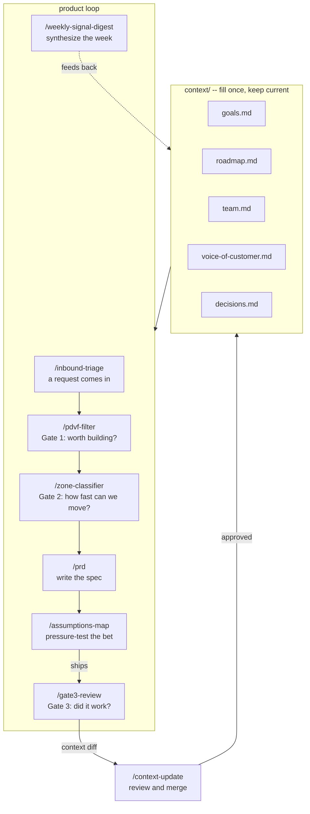

# Seam Starter Kit

The bottleneck in product work used to be writing code.
It isn't anymore.

At AI-assisted velocity, a team can ship five features in the time
it used to take to ship one. The constraint has moved: to deciding
what to build, keeping everyone working from the same reasoning,
and knowing whether what shipped actually changed anything.

Seam is the context layer that makes those three things possible.
It gives every AI tool on your team the same background before it
starts: your goals, your customer signal, your standing decisions,
and the reasoning behind them.

This is the starter kit. Fifteen minutes to set up. Built on Claude Code.

[](https://creativecommons.org/licenses/by/4.0/)

## What you need

- [Claude Code](https://claude.ai/code) installed (`npm install -g @anthropic-ai/claude-code`)
- A Claude account (Pro or above recommended)
- 15 minutes to fill in your context files

## Setup

**1. Clone this repo**

```bash
git clone https://github.com/davemastersnyc/seam-starter.git
cd seam-starter
```

**2. Fill in your context files**

Open the `context/` folder. Each file has instructions inside. Fill in:

- `context/goals.md` -- what the team is trying to move this quarter
- `context/roadmap.md` -- what's in flight and planned
- `context/team.md` -- who's on the team and how decisions get made
- `context/voice-of-customer.md` -- customer signal, themes, direct quotes
- `context/decisions.md` -- standing decisions and the reasoning behind them

Be honest and specific. Skills are only as useful as the context they draw from.

**3. Open Claude Code**

```bash
claude
```

**4. Run a skill**

Type `/inbound-triage` and describe a request that came in this week.

## How to edit your context files

Open the `context/` folder in any text editor. If you're not sure which one to use:

- Cursor (recommended if you're using Claude Code anyway)
- VS Code
- Any plain text editor. TextEdit on Mac, Notepad on Windows.
- Or just open them directly in GitHub and edit in the browser if you cloned from there.

The files are plain markdown. You don't need to know markdown to fill them in. Write in plain sentences. The skills don't care about formatting.

## How it works

Every skill reads from your `context/` files before generating output. You fill the context once and keep it current. The skills handle the rest.



the write-back loop is the feedback mechanism. /gate3-review generates the diff. /context-update merges it. the weekly digest feeds in lighter signal between gate 3 reviews.

## Skills

| Command | What it does |
|---|---|
| `/inbound-triage` | Score an inbound request against your goals |
| `/pdvf-filter` | Gate 1 -- score an idea on Problem, Desirability, Viability, Feasibility |
| `/zone-classifier` | Gate 2 -- classify work by risk and dependency level |
| `/gate3-review` | Gate 3 -- did shipped work actually change behavior? |
| `/context-update` | merge a gate 3 context diff back into your context files. one human reviews before anything is written. |
| `/prd` | Full PRD grounded in your goals and customer signal |
| `/assumptions-map` | Map and pressure-test the riskiest assumptions behind a bet |
| `/weekly-signal-digest` | Synthesize the week's signal every Monday |

## Keeping Context Current

the write-back loop handles this automatically.

when /gate3-review runs, it produces two outputs: the outcome verdict and a context diff. paste the diff into /context-update. review the proposed changes. approve, edit, or reject. if approved, claude code writes the updates back to your context files and logs the change in decisions.md.

the weekly signal digest is the lighter version of this, useful for customer signal that doesn't come from a gate 3 review. run it monday morning and skim the output for anything that should update your context files.

a gate 3 review that produces no context diff is a flag. something was learned. if the diff is empty, write one sentence in your linear ticket explaining why.

## Upgrade: live context API

The starter kit reads from local files. When you're ready for context that updates automatically -- without anyone editing markdown by hand -- deploy the included API service.

```
seam-starter/
  api/          ← deploy this to Vercel
  context/      ← files the API serves
```

Note: the live API requires a cron secret to trigger automatic updates. Without it, the API works locally but context will not update automatically in production. To set this up, add `CRON_SECRET` to your Vercel environment variables. See [`api/README.md`](api/README.md) for the exact setup steps. Until that's configured, file-based mode works fully and nothing breaks -- updates just require a manual deploy.

The API reads your context files from a public URL (default: GitHub raw content) and returns them as JSON. Any tool that commits to your repo updates the context automatically. Skills detect the API and switch to it when `SEAM_API_URL` is set in `.env.local` -- file-based mode stays fully functional without it.

Working across multiple repos? Keep one context repo and point all your other repos at it via `SEAM_API_URL`. Update context once, every skill everywhere reads it automatically.

See [`api/README.md`](api/README.md) for setup instructions.

## Want the full version?

The starter kit is self-serve. The full Seam installation includes a configured live context API, tool integrations (Linear, Slack, Intercom), and a setup tailored to your team's workflow.

Book a scoping call: https://tidycal.com/davemastersnyc

---

Built by [Dave Masters](https://quietbranches.com) / [Quiet Branches Labs](https://quietbranches.com)
Licensed under [CC BY 4.0](https://creativecommons.org/licenses/by/4.0/) -- share and adapt freely with attribution.
